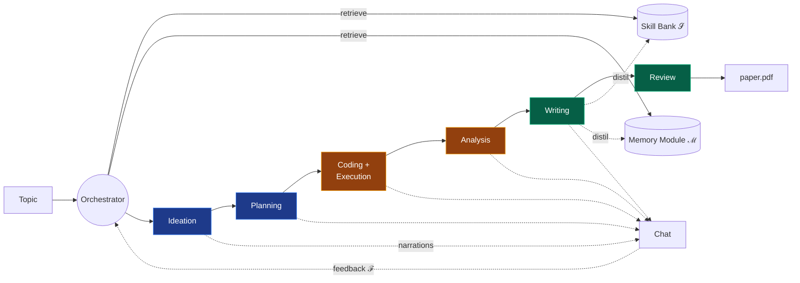
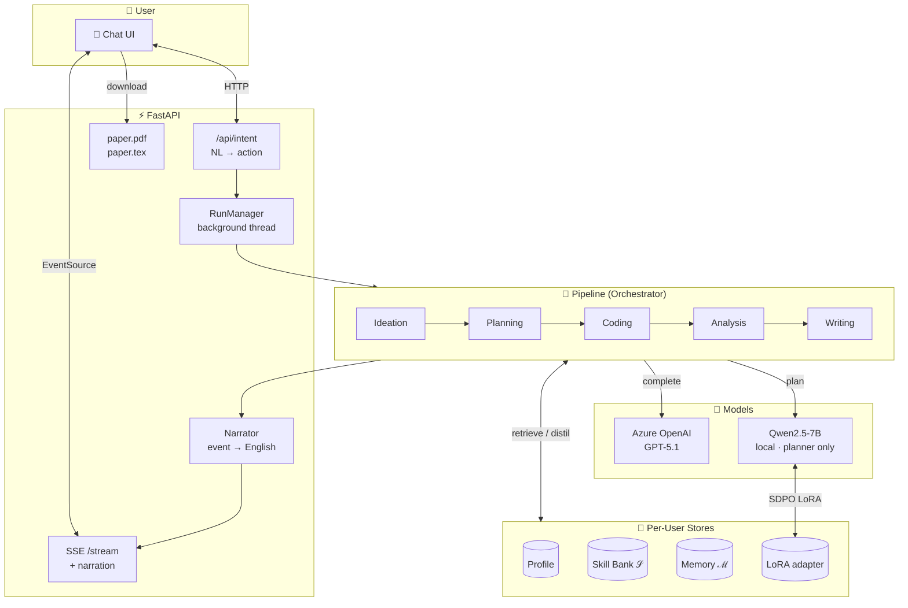

<!-- markdownlint-disable MD033 MD041 -->

<div align="center">

# 🔬 NanoResearch

**A tri-level co-evolving multi-agent research automation system.**

_Re-implementation of [NanoResearch (arXiv:2605.10813)](https://arxiv.org/abs/2605.10813) with a ChatGPT-style web UI and field-agnostic prompts._

[](LICENSE)
[](https://www.python.org/)
[](https://fastapi.tiangolo.com/)
[](https://react.dev/)
[](#testing)
[](https://saadmsft.github.io/nanoresearch/)

[**📖 Documentation**](https://saadmsft.github.io/nanoresearch/) ·
[**🏗 Architecture**](https://saadmsft.github.io/nanoresearch/architecture/) ·
[**🚀 Quickstart**](#quickstart) ·
[**📄 Original paper**](https://arxiv.org/abs/2605.10813)

</div>

---

> _"Automation **for whom**? Researchers operate under different resource configurations, hold different methodological preferences, and target different output formats. A system that produces uniform outputs regardless of these differences will systematically under-serve every individual user."_
>
> — NanoResearch (Xu et al., 2026)

NanoResearch takes a one-line research idea — in **any scholarly field** — and rides it through ideation, planning, experimentation, analysis, writing, and review to produce a downloadable LaTeX paper, while **learning your preferences** so the next run feels more like _you_.

## ✨ Highlights

- 💬 **Single chat surface.** No buttons. Tell it your field and a topic; it narrates the pipeline back to you and pauses for feedback at every stage.
- 🌍 **Field-agnostic.** Biology, social sciences, engineering, mathematics, computer science — prompts adapt to the field's conventions (regressions vs. proofs vs. case studies vs. ablations).
- 🧠 **Tri-level co-evolution.** Per-user **Skill Bank** (procedural rules), **Memory Module** (project-specific facts), and a planner adapter trained via **SDPO** from your free-form feedback.
- 🔬 **Real artefacts.** Generates and **runs** a Python project for empirical fields, parses results, then assembles a section-by-section LaTeX paper that compiles to PDF (when `pdflatex` is installed).
- 🔐 **Azure AD auth.** Talks to your private GPT-5.1 deployment via `DefaultAzureCredential` — no API keys in `.env`.

<div align="center">

### Pipeline at a glance



</div>

## 🗂 What's in the box

| Component | Folder | Purpose |
|---|---|---|
| 🧠 **Backend (Python)** | [`src/nanoresearch/`](src/nanoresearch/) | Multi-agent pipeline, FastAPI server, Skill/Memory stores, SDPO trainer |
| 💬 **Frontend (React + Vite)** | [`ui/`](ui/) | Chat-first UI with assistant-ui–style bubbles and live SSE narrations |
| 📚 **Documentation site** | [`docs/`](docs/) | Jekyll-friendly markdown; deployed to GitHub Pages |
| 🖼 **Diagrams** | [`docs/assets/diagrams/`](docs/assets/diagrams/) | Mermaid sources + rendered PNGs |
| 🧪 **Tests** | [`tests/`](tests/) | 61 unit + integration tests, offline-runnable |

## 🚀 Quickstart

### Prerequisites

- Python **3.11+** (3.12 tested)
- Node **18+** (Vite + assistant-ui)
- An **Azure OpenAI / Foundry** deployment of GPT-5.1 (or a compatible reasoning model)
- `az login` performed locally; your account needs the **Cognitive Services OpenAI User** role
- _(optional)_ `pdflatex` or `tectonic` for PDF compilation — otherwise the paper ships as `.tex`
- _(optional)_ Apple-Silicon Mac with 32 GB+ unified RAM for the local Qwen planner (SDPO)

### Setup

```bash
# 1. Clone + venv
git clone https://github.com/saadmsft/nanoresearch.git
cd nanoresearch
python3.12 -m venv .venv
source .venv/bin/activate
pip install -e ".[dev]"

# 2. Configure Azure (AAD auth — no API keys)
cp .env.example .env
# edit AZURE_OPENAI_ENDPOINT + AZURE_OPENAI_DEPLOYMENT
az login

# 3. Backend
nanoresearch serve            # http://127.0.0.1:8000

# 4. Frontend (separate terminal)
cd ui && npm install && npm run dev   # http://localhost:5173
```

Open <http://localhost:5173> and say hi.

### Optional: local SDPO planner

```bash
pip install -e ".[local]"     # torch, transformers, peft, accelerate
huggingface-cli download Qwen/Qwen2.5-7B-Instruct \
  --local-dir data/models/Qwen2.5-7B-Instruct
```

## 💬 What it looks like

```text
You ▸ I'm Mia, an ecologist. I prefer field studies, 6-month timeline.
      Start a run on canopy cover and breeding-bird richness in city parks.

NanoResearch ▸ Nice to meet you, Mia. Starting on canopy cover + bird richness.
NanoResearch ▸ 🔎 Searching scholarly databases…
NanoResearch ▸ 📚 Done. 12 papers.
NanoResearch ▸ 💡 Drafted hypotheses (n=6). Checking novelty next.
NanoResearch ▸ 🎯 Going with: Canopy × heterogeneity interaction predicts richness.
NanoResearch ▸ ⏸ Paused at ideation — what should I emphasise or change?

You ▸ Keep the design simple and proceed.

NanoResearch ▸ 📐 Drafting an experiment blueprint…
NanoResearch ▸ 👀 Running an internal peer review of the blueprint…
NanoResearch ▸ 🧪 Writing a small experiment project to test the plan…
NanoResearch ▸ ▶️ Running the experiment…
NanoResearch ▸ 📈 Run finished (ok=True exit=0 dur=3.2s).
NanoResearch ▸ 📊 Analysing results…
NanoResearch ▸ ✍️ Drafting the introduction / method / experiments / … sections.
NanoResearch ▸ 👓 Reviewing the paper draft.
NanoResearch ▸ 📄 Paper compiled. [Download PDF] — or the [LaTeX source].
```

## 🏛 Architecture

NanoResearch is a **stage pipeline** orchestrated around two persistent stores and one trainable planner.



📖 **Full architecture deep-dive:** [docs/architecture.md](docs/architecture.md) · [paper §3 mapping](docs/paper-mapping.md) · [SDPO math](docs/sdpo.md)

## 🧪 Testing

```bash
pytest -m "not azure and not local_model"   # 61 offline tests
pytest -m azure                              # AAD smoke
pytest -m local_model                         # Qwen MPS smoke
```

| Suite | Tests |
|---|---|
| Config + manifest + router | 9 |
| Stores (schemas, retrieval, distill) | 18 |
| Orchestrator | 8 |
| Stage I (literature + ideation + planning) | 9 |
| Stage II + III (sandbox, narrator, TeX, schemas) | 9 |
| HTTP API | 7 |
| SDPO (gradient + LoRA) | 3 (opt-in) |
| Azure / local smoke | 2 (opt-in) |

## 📂 Repository layout

```text
nanoresearch/
├── src/nanoresearch/
│   ├── agents/           # Stage I-III stage controllers + prompts + artefacts
│   ├── api/              # FastAPI app, RunManager, intent classifier, narrator
│   ├── cli/              # `nanoresearch serve`, `health`, `settings`
│   ├── config/           # pydantic-settings
│   ├── literature/       # OpenAlex client + evidence extraction
│   ├── llm/              # Azure (AAD) + local Qwen backends, agent-role router
│   ├── logging/          # structlog + per-run JSONL manifest
│   ├── orchestrator/     # Retrieve → Plan → Dispatch → Reflect → Update
│   ├── planner/          # Qwen wrapper + LoRA + SDPO trainer (Eq. 14-15)
│   ├── schemas/          # Profile / Skill / Memory pydantic models
│   └── stores/           # SkillBank + MemoryStore + Profile (JSON-backed)
├── ui/                   # React + TypeScript + Tailwind chat
├── docs/                 # Jekyll site (GitHub Pages)
├── tests/                # Pytest suite
├── runs/                 # ← created at runtime (event logs + papers/<run>/paper.tex)
└── data/users/<id>/      # ← created at runtime (profile, skills, memories, lora)
```

## 🗺 Roadmap

- [x] Phase 0–4 — bootstrap, stores, planner+SDPO, orchestrator, Stage I (Ideation + Planning)
- [x] Phase 5 — Stage II (Coding + sandboxed exec + debug loop) + Analysis
- [x] Phase 6 — Stage III (Writing + Reviewer + LaTeX/PDF)
- [x] FastAPI + React/Vite UI with live SSE narrations
- [ ] Phase 7 — Compliance/Novelty/Writing judges (paper §8–10) + 20-topic benchmark harness
- [ ] Phase 8 — CLI ergonomics (`nanoresearch run`, `nanoresearch eval`)
- [ ] Docker sandbox upgrade for Stage II
- [ ] Per-section figure generation + bibliography auto-fill

## 📜 Citation

If this implementation is useful in your research, please cite the original paper:

```bibtex
@misc{xu2026nanoresearch,
  title  = {NanoResearch: Co-Evolving Skills, Memory, and Policy for Personalized Research Automation},
  author = {Xu, Jinhang and Zhu, Qiyuan and Wu, Yujun and Wang, Zirui and Zhang, Dongxu and others},
  year   = {2026},
  eprint = {2605.10813},
  archivePrefix = {arXiv},
  primaryClass  = {cs.AI},
  url    = {https://arxiv.org/abs/2605.10813}
}
```

## 📄 License

Apache 2.0 — see [LICENSE](LICENSE).

Original NanoResearch paper © Xu et al., 2026.  
This implementation is independent and not affiliated with the original authors.
