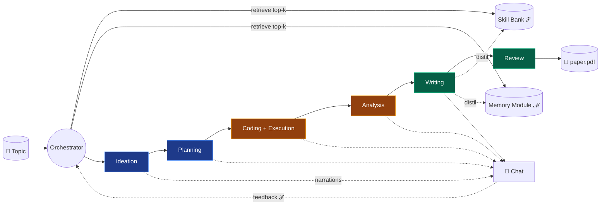
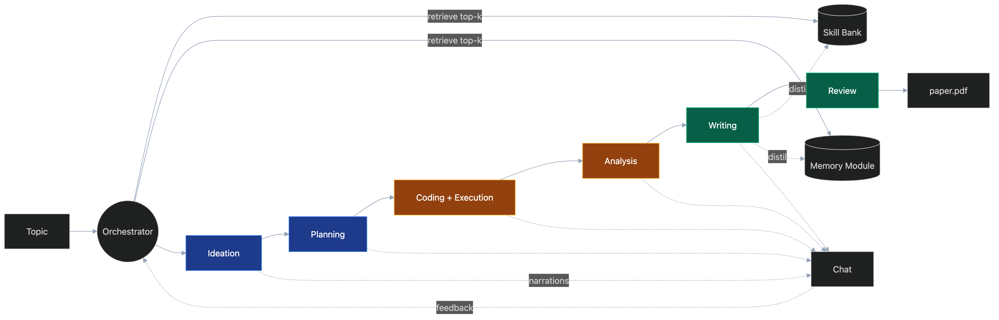
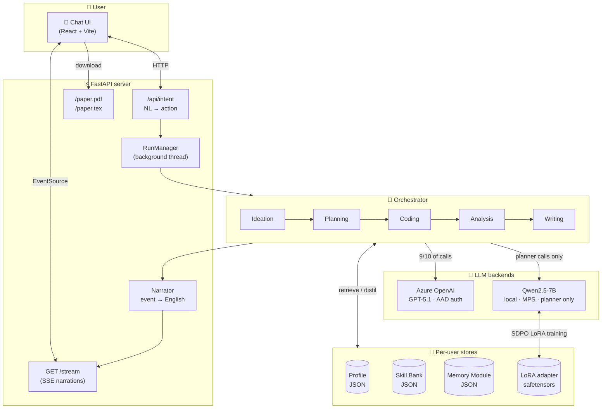
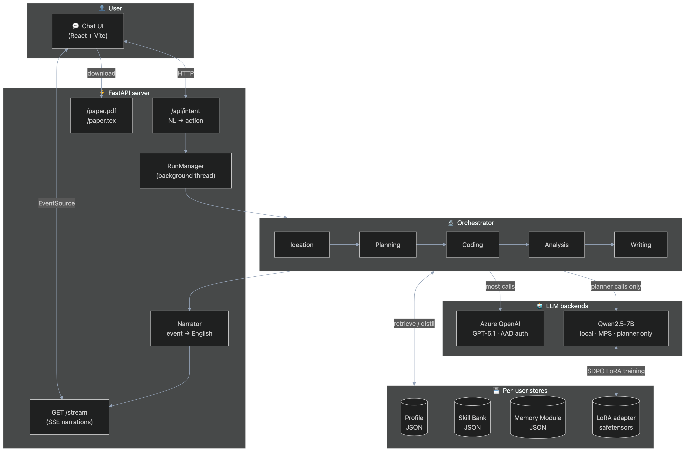
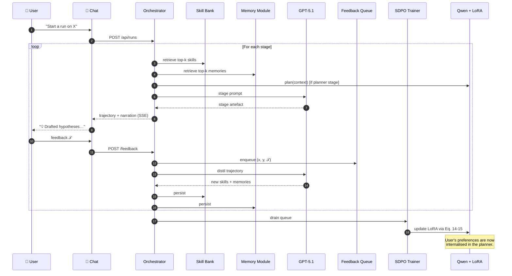
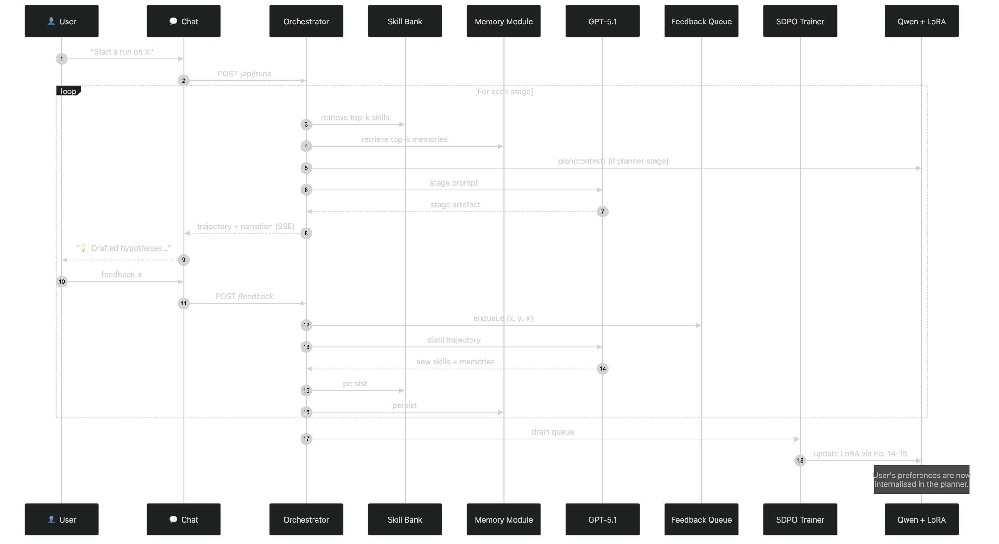

# 🏛 Architecture

[← Home](index.html)

NanoResearch is a **5-stage pipeline** orchestrated around two persistent stores
and one trainable planner. Each stage is a subclass of `Stage` that the
`Orchestrator` invokes in sequence, pausing for user feedback at strategic
points.

## Pipeline overview





## System layout





## Co-evolution loop





## Per-user filesystem layout

```text
data/users/<user_id>/
├── profile.json
├── skills/
│   ├── skill-1a2b3c4d.json
│   └── …
├── memories/
│   ├── mem-9f8e7d6c.json
│   └── …
└── lora/
    └── <user_id>/
        ├── adapter_config.json
        └── adapter_model.safetensors

runs/
├── workspaces/proj-<id>/    # ← CodingStage writes here
│   ├── run.py
│   ├── analysis.py
│   └── tables/, figures/
├── papers/proj-<id>/        # ← WritingStage writes here
│   ├── paper.tex
│   └── paper.pdf            # if pdflatex/tectonic installed
└── <run-id>/
    └── events.jsonl         # full audit trail (one line per event)
```

## What runs where

| Stage | Inputs | Output artefact | LLM role |
|---|---|---|---|
| **Ideation** | Topic, profile, skills, memories | `IdeationArtefacts` (h*) | `IDEATION` |
| **Planning** | h*, profile | `Blueprint` (peer-reviewed) | `PLANNING` + `REVIEW` |
| **Coding** | Blueprint | `GeneratedProject` + `ExecutionResult` | `CODING` + `DEBUG` |
| **Analysis** | ExecutionResult | `AnalysisReport` | `ANALYSIS` |
| **Writing** | Blueprint + Analysis | `PaperDraft` + `CompiledPaper` | `WRITING` + `REVIEW` |

## Key design decisions

- **Single-process backend, threaded runs.** Simple to reason about; one
  `RunManager` owns every run via background threads pushing onto an
  `asyncio.Queue` consumed by the SSE handler.
- **JSON-per-file stores.** Skill Bank and Memory Module are
  one-file-per-entry under `data/users/<id>/`. Transparent to inspect,
  trivial to diff in git.
- **AAD-only Azure auth.** No keys in `.env`. Uses
  `DefaultAzureCredential` → `get_bearer_token_provider` for the
  `openai.AzureOpenAI` client.
- **Field-agnostic prompts.** Every stage's system prompt explicitly invites
  the LLM to adapt to the user's field (biology, social science, math, …).
- **Network-free Stage II.** Generated experiment projects must run with the
  Python stdlib + numpy and may not call out to the internet — we simulate
  small synthetic data and let the analysis surface the methodological
  finding.
