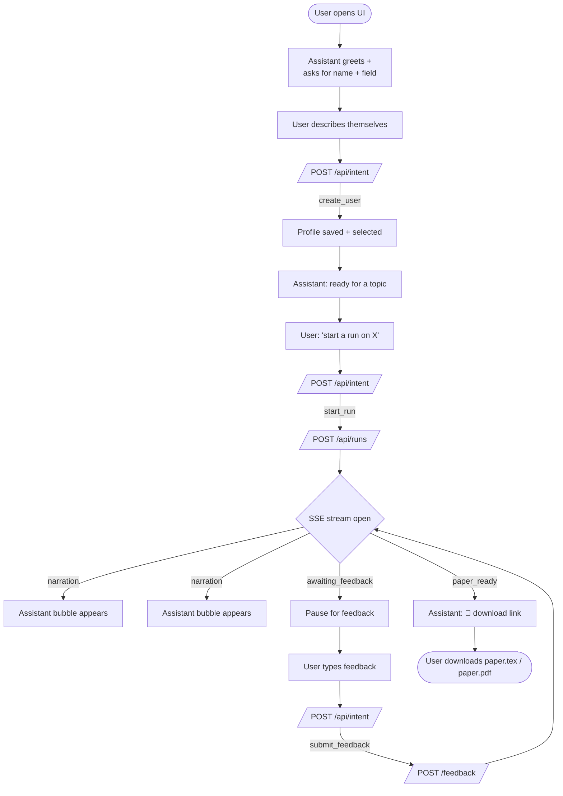

# 💬 Chat & UX design

[← Home](index.html)

NanoResearch's UI is **one chat, one sidebar**. There are no buttons for
"start", "save profile", or "submit feedback" — every action is a natural-language
message in the chat.

## Layout

```text
┌──────────────────────────────────────────────────┬────────────────┐
│  NanoResearch                       demo · ready │  Profile       │
│                                                  │  ─────────     │
│  💬 Chat thread (assistant + user bubbles)       │  archetype     │
│                                                  │  domain        │
│  ▸ user msg                                      │                │
│      ◂ assistant narration                       │  Pipeline      │
│      ◂ another narration                         │  ●○○○○○        │
│      ◂ paper-ready link                          │                │
│                                                  │  What I've     │
│  ┌────────────────────────────────────────────┐  │  learned       │
│  │ tell me a topic, or refine your profile…   │  │  3 skills      │
│  │                                        SEND│  │  5 memories    │
│  └────────────────────────────────────────────┘  │                │
└──────────────────────────────────────────────────┴────────────────┘
```

## Conversational flow



## Why no slash commands?

We support `/help`, `/start`, etc. as a **fast path**, but they're documented
only via `/help` and never required. Every slash command is also expressible
in natural English; the backend's intent classifier (`POST /api/intent`)
hands either form off to the same action enum.

This means:

- New users discover features through the welcome message.
- Power users still get keyboard speed.
- Voice-style commands ("_switch to my colleague Saad's profile_") just work.

## Narrations vs. raw events

Each pipeline event the backend pushes onto the SSE queue is fanned out as
two separate events:

1. The **technical** `trajectory_event` — keys like `label`, `detail`,
   `metadata`. Available to UIs that want the granular view.
2. A **narration** event — a single human-readable `text` field that the
   chat renders directly as an assistant bubble.

The `Narrator` is a pure function in
[`api/narrator.py`](https://github.com/saadmsft/nanoresearch/blob/main/src/nanoresearch/api/narrator.py) — no LLM, no extra latency, just an event-label → English string table. Easy to localise later (swap the table per locale).

## State persistence

Browser-side, we persist via `localStorage`:

| Key | Purpose |
|---|---|
| `nano.userId` | Active profile id |
| `nano.runId` | Active run id (auto-cleared when run terminates) |
| `nano.chat.thread` | The visible chat history (last 200 turns) |

This lets a user refresh the page mid-run and pick up where they left off
in both the chat thread and the sidebar status.

## Markdown subset rendered in chat

The chat renders a tiny, fast, dependency-free markdown subset:

- `**bold**`, `_italic_`, `` `code` ``
- `[text](url)` links — used for paper downloads
- `- ` bullets
- Blank lines as paragraph breaks

No tables, no headings, no code-fences. Keeps the chat dense and on-brand.

## Sidebar contents

| Card | Refresh policy |
|---|---|
| **Profile** | Updates on `selectUser` / `upsertUser` |
| **Pipeline** | Polled every 8 s while run is non-terminal; stops on `completed`/`failed` |
| **What I've learned about you** | Polled every 15 s while run is live; static otherwise |

The pipeline card shows six dots (ideation → planning → coding → analysis
→ writing → review) — done = green, active = amber pulse, awaiting
feedback = sky-blue pulse with a "needs feedback" badge.
